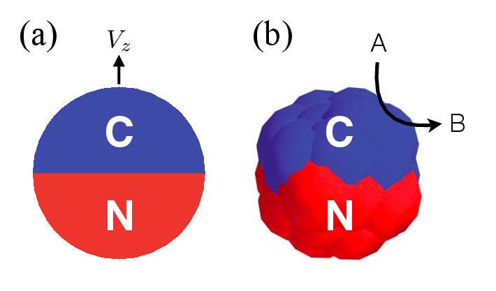

.. _tutorial:

Tutorial
========

This tutorial introduces the reader to particle-based simulations of nanomotors. The main
simulation method consists of a coupled scheme of Multiparticle Collision Dynamics (MPCD),
for the fluid, and Molecular Dynamics (MD), for the motor. Chemical activity is introduced
in the fluid via a surface-induced catalytic effect and bulk kinetics.

To start working with RMPCMD, visit the :ref:`install` section first.

Introduction
------------

Nano- to micro-meter scale devices that propel themselves in solution
are built and studied since about a decade. They represent a promise of
future applications at scales where usual control strategies reach their
limits and, ideally, autonomous action replaces manual control.

It is possible to compute, via phoretic theory, the stationary regime of
operation of nanomotors in simple geometries. Still, testing geometrical
effects or including fluctuating behaviour is best done using numerical
simulations. A successful modeling strategy was started by Rückner and
Kapral in 2007 :cite:`ruckner_kapral_prl_2007`.
It builds on a particle-based fluid, explicitly
the Multiparticle Collision Dynamics (MPCD) algorithm. The flexibility
of particle-based simulations allowed for numerous extensions of their
work to Janus particles, polymer nanomotors, various chemical kinetics,
thermally active motors, among others.

The principle of the hybrid scheme is very close to full Molecular
Dynamics (MD), with the major difference that solvent-solvent
interactions are not explicitly computed and are replaced by cell-wise
collisions at fixed time intervals. This saves computational time and
renders otherwise untractable problems feasible.

In Ref. :cite:`ruckner_kapral_prl_2007`, the authors introduce a computational model for a
dimer nanomotor
that is convenient thanks to its simple geometry. There are two spheres
making up the dimer, linked by a rigid bond, one of which being
chemically active and the other not. Solvent particles in contact with
the chemically active sphere are converted from product to fuel. The
active sphere thus acts as a sink for reagent particles (the "fuel") and
a source for product particles.

Preliminary remarks
-------------------

This tutorial does not intend to cover all *possible* manners to conduct
nanomotor simulations. Rather, it aims at presenting one strategy for
modeling chemically powered nanomotors, that is the combination of a
chemically active MPCD fluid coupled to possibly catalytic colloidal
beads.

While this tutorial relies on the RMPCDMD software, it is worth mentioning that Peter
Colberg has also made his software for dimer nanomotor simulations available openly
:cite:`colberg_nanodimer_web`. ``nano-dimer`` is based on OpenCL and can benefit from GPU
acceleration.

Literature
----------

The MPCD algorithm was introduced in :cite:`malevanets_kapral_mpcd_1999` and
:cite:`malevanets_kapral_mpcd_2000`. General reviews on the MPCD simulation method are
available in the literature.

- Raymond Kapral, *Multiparticle collision dynamics: simulation of complex
  systems on mesoscales*, Adv. Chem. Phys. **140**, 89 (2008).
  :cite:`kapral_adv_chem_phys_2008`

- G. Gompper, T. Ihle, D. M. Kroll and R. G. Winkler, *Multi-Particle Collision Dynamics: A
  Particle-Based Mesoscale Simulation Approach to the Hydrodynamics of Complex Fluids*,
  Adv. Polymer Sci. **221**, 1 (2008).
  :cite:`gompper_et_al_adv_polym_sci_2008`

An overview of chemically powered synthetic nanomotors has been published by Kapral
:cite:`kapral_perspective_jcp_2013`.

There is no literature on the practical conduct of nanomotor simulations, however.

The MPCD fluid and Molecular Dynamics
-------------------------------------

A MPCD fluid consists of point particles with a mass (set to unity here
for convenience), a position :math:`x` and a velocity :math:`v`. The
particles evolve in two step: (i) indepedent streaming of the particles
for a duration :math:`\tau` and (ii) cell-wise collision of the
particles’ velocities.

For particle :math:`i` this results in the following equations:

.. math::
   :label: stream

   x_i' = x_i + v_i \tau

and

.. math::
   :label: collide

   v_i' = v_\xi + \omega_\xi ( v_i - v_\xi )

where the prime denotes the quantities after the corresponding step, :math:`\xi` is a cell,
:math:`\omega_\xi` is a rotation operator and :math:`v_\xi` is the center-of-mass velocity
in the cell. The cell consists in a regular lattice of cubic cells in space. Equations
:eq:`stream` and :eq:`collide` conserve mass, energy and linear momentum.

The viscosity for a MPCD fluid can be computed from its microscopic
properties:

.. math::

     \eta = \frac{k_BT\tau\rho}{2m} \left( \frac{ 5\gamma - (\gamma-1+e^{-\gamma})(2-\cos\alpha-\cos 2\alpha) }{(\gamma - 1 + e^{-\gamma})(2-\cos\alpha-\cos 2\alpha)} \right) + \frac{m}{18 a \tau} (\gamma -1 + e^{-\gamma})(1-\cos\alpha)

One can embed a body in a MPCD fluid by using a explicit potential
energy. Then, the streaming step is replaced by the velocity-Verlet
integration scheme. Collision involve only fluid particles and not the
colloid.

The dimer nanomotor
-------------------

Physical setup
^^^^^^^^^^^^^^

In this section, we review the propulsion of the dimer nanomotor
presented by Rückner and Kapral. The geometry of the motor and the
chemical kinetics are presented in :numref:`simpledimer`.

The solvent consists of particles of types A and B, initially all
particles are set to A (the fuel). Fuel particles that enter the
interaction range of the catalytic sphere are flagged for reaction but
the actual change of A to B only occurs when the solvent particle is
outside of any interaction range. Else, the change would generate a
discontinuous jump the in the potential energy and disrupt the
trajectory. This chemical activity generates an excess of product
particles "B" around the catalytic sphere and a gradient of solvent
concentration is established.

.. _simpledimer:

.. figure:: simple_dimer.png

   Geometry and chemistry for the dimer nanomotor. The graph sketched below represents the
   local excess of “B” particles that is asymmetric for the “N” sphere. Many more “A” and
   “B” particles not shown.

In this type of simulation, the total energy is conserved but the system is maintained in
nonequilibrium by *refueling*, that is by changing B particles to species A when they are
far enough from the colloid.

The solvent and colloids interact via a purely repulsive Lennard-Jones potential of the form

.. math:: V(r) = 4 \epsilon \left( \left(\frac{\sigma}{r}\right)^{12} - \left(\frac{\sigma}{r}\right)^{6} - 1 \right)

where :math:`\epsilon` and :math:`\sigma` can be different depending on the combination of
solvent and colloid species.

Simulation setup
^^^^^^^^^^^^^^^^

Within RMPCDMD, the simulation program for the dimer is called ``single_dimer_pbc``. This
program requires a configuration file that contains the physical parameters, an example of
which is given in the listing below.

::

    # physical parameters
    T = .16666666
    L = 32 32 32
    rho = 9
    tau = 1.0
    probability = 1.0

    # simulation parameters
    N_MD = 200
    N_loop = 50

    # interaction parameters
    sigma_N = 4.0
    sigma_C = 2.0

    d = 6.8
    epsilon_N = 1.0 0.1
    epsilon_C = 1.0 1.0

    epsilon_N_N = 1.0
    epsilon_N_C = 1.0
    epsilon_C_C = 1.0

The configuration allows one to set the size of both spheres in the dimer as well as the
interaction parameters. The setting ``epsilon_N`` contain the prefactor to the Lennard-Jones
potential for the "N" sphere and all solvent species on a single line. In this example, all
the interaction parameters are set to 1 except for the interaction between the "N" sphere
and "B" solvent particles, as was done in :cite:`ruckner_kapral_prl_2007`.

Running the simulations
^^^^^^^^^^^^^^^^^^^^^^^

.. note:: Make sure that you have built the code properly (see :ref:`install`) and that the
          command-line tool ``rmpcdmd`` is available at your command-line prompt. You will
          also need a working scientific Python environment (see :ref:`install_python`).

An example simulation setup is provided in the directory ``experiments`` of RMPCDMD. There,
the sub-directory ``01-single-dimer`` contains a parameter file.

Review the parameters in the file ``dimer.parameters`` then execute the
code

.. code:: bash

    make dimer.h5

The actual commands that are executed will be shown in the terminal.

Analyzing the data
^^^^^^^^^^^^^^^^^^

The output of the simulation is stored in the file ``dimer.h5``, that follows the H5MD
convention for storing molecular data :cite:`h5md_cpc_2014`. H5MD files are regular HDF5
files and can be inspected using the programs distributed by the HDF Group. Issue the
following command and observe the output:

.. code:: bash

    h5ls dimer.h5

HDF5 files have an internal directory-like structure. In ``dimer.h5``
you should find

::

    fields                   Group
    h5md                     Group
    observables              Group
    parameters               Group
    particles                Group
    timers                   Group

The elements are called "groups" in HDF5 terminology. Here, there is data about the
particles (positions, velocities, etc), observables (e.g.  temperature) and fields (here,
the histogram of "B" particles). The ``h5md`` group contains metadata (simulation creator,
H5MD version, etc.), the ``timers`` group contains timing data that is collected during the
simulation and ``parameters`` contains all the parameters with which the simulation was run.

The command

.. code:: bash

    h5ls -r dimer.h5

will visit all groups recursively. The output is then rather large. Let
us focus first on the velocity of the dimer, it is located at
``/particles/dimer/velocity``, where it is stored in ``value`` and the
time step information of the dataset is stored in ``step`` and ``time``.
In the present case, the velocity is sampled at regular time interval of
100 timesteps or equivalently 1 in units of :math:`\tau`.

All the data analysis in this tutorial is done using the Python language
and a set of libraries: NumPy for storing and computing with array data,
h5py for reading HDF5 files, matplotlib for plotting and SciPy for some
numerical routines. For installation, see appendix [install-py]. Some
generic programs are provided with as an introduction to reading the
files, such as ``h5md_plot.py``. Its usage is

.. code:: bash

    python h5md_plot.py dimer.h5 --obs temperature

(the ``obs`` option is preceded by two dashes) to display the
temperature in the course of time. This program can also display the
trajectory of the dimer

.. code:: bash

    python h5md_plot.py dimer.h5 --traj dimer/position

More specific information on the dimer nanomotor can be obtained via Python programs located
in the ``experiments/01-single-dimer`` directory.

The directed velocity, that is the velocity in the direction of the motor's propulsion axis,
can be obtained via

.. code:: bash

    python plot_velocity.py dimer.h5 --directed

A further option ``--histogram`` show an histogram instead of the time-dependent value.

Finally, an important quantity to assess both for theory and experiments is the effective
diffusion that results from both thermal fluctuations and the combination of self-propelled motion and random reorientation.

.. code:: bash

    python plot_msd.py dimer.h5

This latter program can take several simulation files as input to obtain better
statistics. It is also important to use a much simulation time (``N_loop``) than the default
one to produce meaningful results.

The Janus nanomotor
-------------------

A Janus motor comprises two hemispheres with one chemically active surface and one inactive
surface as shown in :numref:`janusfigure` (a). Because chemical reactions happen asymmetrically on the Janus
motor surface, a concentration gradient of product particles is generated giving rise to
self-propulsion. In 2013, de Buyl and Kapral introduced a composite model for Janus motor
:cite:`de_buyl_kapral_nanoscale_2013`, see :numref:`janusfigure` (b). The active (blue, C) and inactive
(red, N) parts are composed of spheres linked by rigid bonds. These spheres have the same
radius, and interact with the surrounding solvent particles through repulsive Lennard-Jones
potentials :math:`V_{\alpha C}` and :math:`V_{\alpha N}`, where :math:`\alpha = A, B` is the
type of solvent species.

An example simulation setup for self-proplusive Janus motor is provided in the directory
``experiments/03-single-janus``. The parameter file is show below:

::

    # physical parameters
    T = .333333333
    L = 32 32 32
    rho = 9
    tau = 1.0
    probability = 1

    # simulation parameters
    N_MD = 50
    N_loop = 50

    # interaction parameters
    sigma_colloid = 1
    epsilon_colloid = 1

    sigma = 3
    epsilon_N = 1.0 0.5
    epsilon_C = 1.0 0.5

    epsilon_N_N = 1.0
    epsilon_N_C = 1.0
    epsilon_C_C = 1.0
    bulk_rate = 0.001

To run the simulation, use ``make simulation``, and check the propulsion speed :math:`V_z`
with

.. code:: bash

    python plot_velocity.py janus.h5 --directed

.. _janusfigure:

    (a) The sketch of a Janus particle with active (C) and inactive (N) hemispherical
    surface moving along particle axis with velocity :math:`V_z`. (b) The composite model
    for Janus particle. Chemical reactions, :math:`A \to B`, take place at the active
    surface.

Controls of motor speed
^^^^^^^^^^^^^^^^^^^^^^^

For Janus particles, one can obtain from phoretic theory that the propulsion speed is
determined by factors such as the system temperature, fluid properties (viscosity and
density) but also the chemical kinetics and the specific solvent-colloid interactions
:cite:`kapral_perspective_jcp_2013`.

In this section, we explore the effects of the interaction parameters and of the reaction
rate :math:`k_2` on the direction and strength of the propulsion.  By modifying only the
lines below in the parameter file for the janus simulation, it is possible to observe a
reversal of propulsion and the effect of the reaction rate :math:`k_2`.

Example 1, forward moving Janus motor.

::

    epsilon_N = 1.0 0.5
    epsilon_C = 1.0 0.5
    bulk_rate = 0.001

Example 2, backward moving Janus motor.

::

    epsilon_N = 0.5 1.0
    epsilon_C = 0.5 1.0
    bulk_rate = 0.001

Example 3, changing the bulk reaction rate.

::

    epsilon_N = 1.0 0.5
    epsilon_C = 1.0 0.5
    bulk_rate = 0.0001
